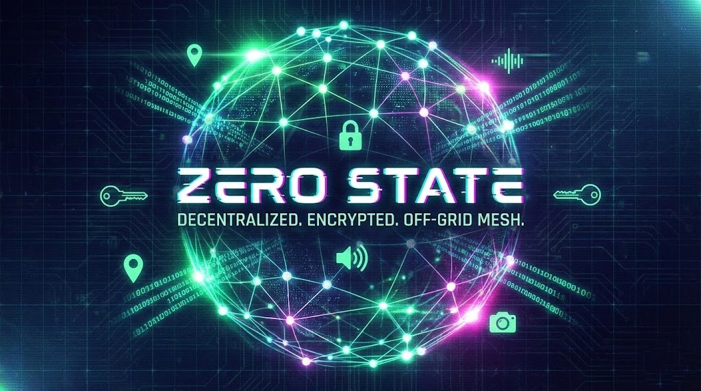

# ZERO STATE



> **A serverless, decentralized browser-based mesh messenger featuring end-to-end encrypted text, voice, and media communication with location-aware channeling.**

[](https://opensource.org/licenses/MIT)
[](https://www.typescriptlang.org/)
[](https://github.com/nostr-protocol/nostr)

---

## 📖 About The Project

**Zero State** is a sovereign communication tool designed to operate entirely in the browser without reliance on central servers, databases, or user accounts.

Inspired by projects like Bitchat and the principles of the Nostr protocol, Zero State creates an ephemeral, encrypted mesh network. It allows users to communicate securely with peers globally or discover local peers using geohashed location channels, all while retaining complete control over their identity and data.

It is "infrastructure-agnostic," using public Nostr relays merely as dumb signal pipes, while all logic, encryption, and data storage happen client-side on the user's device.

### Key Objectives

- **Zero Infrastructure:** No backend servers to maintain or pay for.
- **Zero Knowledge:** The transport layer (relays) cannot read messages.
- **Sovereign Identity:** Your private key is your account. You own it.
- **Offline-First:** Data is persisted locally and works harmoniously with intermittent connections.

## ✨ Features

- **🌐 Decentralized Signaling:** Uses the Nostr protocol mesh to route packets via multiple redundant relays.
- **🔒 End-to-End Encryption (E2EE):** All private direct messages and media are secured using Curve25519 public-key cryptography (via TweetNaCl).
- **📍 Location-Aware Channels:** Automatically generate proximity-based chat rooms using GPS geohashing to find nearby peers without revealing exact coordinates.
- **📸 Rich Media Support:** Send automatically compressed images and captured voice notes securely over the mesh.
- **💾 Local Persistence:** Chat history and identity are stored securely in the browser's IndexedDB, ensuring data survives reloads.
- **💬 Private & Public Modes:** Seamlessly switch between broadcasting to a channel or locking into a secure, encrypted DM channel with a specific peer.
- **📱 Neo-Terminal UI:** A responsive, mobile-first interface styled for quick data entry and readability in the field.

## 🛠️ Architecture Overview

Zero State is built on a layered architecture running entirely in the client browser:

1.  **UI Layer (React/Vite):** Handles user interaction, media capture, and rendering the "Neo-Terminal" interface.
2.  **Application Kernel (App.tsx):** Manages state, coordinates services, and handles command parsing (`/join`, `/nuke`, etc.).
3.  **Crypto Service (TweetNaCl/WebCrypto):** Manages the user's Curve25519 identity keypair and performs encryption/decryption operations.
4.  **Protocol Layer (BinaryProtocol):** Serializes rich data (text, images, audio metadata) into compact binary packets to maximize relay compatibility.
5.  **Signaling Layer (Nostr-Tools):** wraps binary packets into Nostr events and broadcasts them to the relay mesh.
6.  **Storage Layer (IDB):** Persists encrypted identity keys and message history into the browser's IndexedDB.

## 🚀 Getting Started

### Prerequisites

- Node.js (v18+ recommended)
- npm

### Installation

1.  Clone the repository:

    ```bash
    git clone [https://github.com/priyansupattanaik/zero-state.git](https://github.com/priyansupattanaik/zero-state.git)
    cd zero-state
    ```

2.  Install dependencies:

    ```bash
    npm install
    ```

3.  Start the development server:

    ```bash
    npm run dev
    ```

4.  Open your browser to `http://localhost:5173`.

## 🕹️ Usage & Commands

Upon first load, a unique cryptographic identity is generated for you and saved locally.

### Basic Interface

- **Public Broadcast:** Type and hit send. Everyone on your current frequency sees this.
- **Secure DM:** Click a user's ID (e.g., `[a1b2c3]`) in the chat log. The UI turns purple, indicating you are locked into an encrypted channel with that user.
- **GPS Scan:** Click the `GPS` button to automatically switch your frequency to your local geohash neighborhood.
- **Media:** Use the Camera icon for images and hold the Mic icon for voice notes.

### Terminal Commands

Type these into the message input box:

| Command                | Description                                                                                                   |
| :--------------------- | :------------------------------------------------------------------------------------------------------------ |
| `/join <room_name>`    | Manually switch to a specific custom frequency topic (e.g., `/join berlin-ops`).                              |
| `/key`                 | reveal your full Private Key for backup purposes. **Do not share this.**                                      |
| `/login <private_key>` | Restore a previously backed-up identity so you can use it on a new device.                                    |
| `/nuke`                | **Emergency Wipe.** Instantly deletes local databases and identity, then reloads to generate a fresh persona. |
| `/help`                | List available commands.                                                                                      |

## 📦 Tech Stack

- [React](https://reactjs.org/) - UI Framework
- [Vite](https://vitejs.dev/) - Build Tool
- [TypeScript](https://www.typescriptlang.org/) - Type Safety
- [Nostr-Tools](https://github.com/nbd-wtf/nostr-tools) - Decentralized Signaling Protocol
- [TweetNaCl.js](https://tweetnacl.js.org/) - High-level Cryptography (Curve25519/Salsa20)
- [idb](https://github.com/jakearchibald/idb) - IndexedDB Promise Wrapper for persistence
- [Lucide React](https://lucide.dev/guide/packages/lucide-react) - Vector Icons

## 🤝 Contributing

Contributions are what make the open source community such an amazing place to learn, inspire, and create. Any contributions you make are **greatly appreciated**.

1.  Fork the Project
2.  Create your Feature Branch (`git checkout -b feature/AmazingFeature`)
3.  Commit your Changes (`git commit -m 'Add some AmazingFeature'`)
4.  Push to the Branch (`git push origin feature/AmazingFeature`)
5.  Open a Pull Request

## 📄 License

Distributed under the MIT License. See `LICENSE` for more information.
